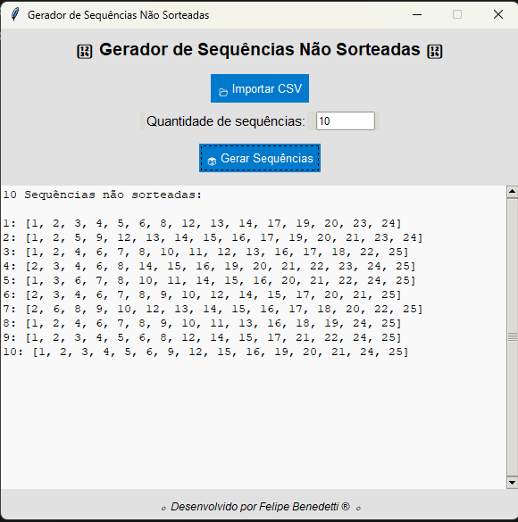
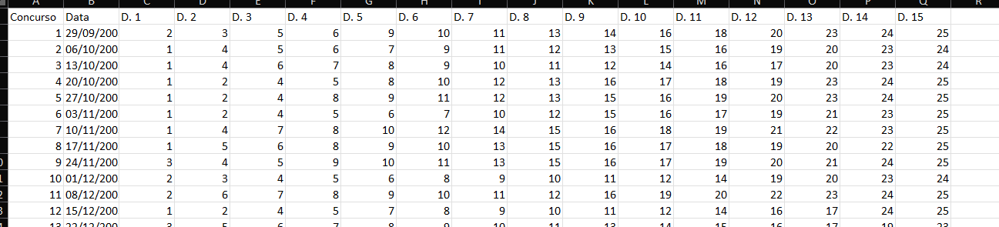

# Gerador de Sequências Não Sorteadas



## Descrição
Este é um aplicativo desktop desenvolvido em Python usando a biblioteca Tkinter. Ele permite importar um arquivo CSV contendo sequências de números sorteados e gerar novas sequências que ainda não foram sorteadas.

## Funcionalidades
- Importar um arquivo CSV com sequências já sorteadas.
- Gerar combinações de números que ainda não foram sorteadas.
- Escolher a quantidade de sequências a serem geradas.
- Exibir os resultados na interface com um layout moderno.

## Tecnologias Utilizadas
- Python 3
- Tkinter (Interface Gráfica)
- CSV (Leitura de arquivos)
- itertools (Geração de combinações)
- random (Seleção aleatória de sequências)

## Instalação e Execução
### Requisitos
- Python 3 instalado

### Passos
1. Clone este repositório:
   ```bash
   git clone https://github.com/FelipeBenedetti/sequencias-nao-sorteadas-lotfacil.git
   ```
2. Navegue até a pasta do projeto:
   ```bash
   cd seu-repositorio
   ```
3. Execute o script:
   ```bash
   python app.py
   ```

## Uso
1. Clique no botão **Importar CSV** e selecione o arquivo contendo os números sorteados.
2. Insira a quantidade de sequências que deseja gerar.
3. Clique em **Gerar Sequências** para exibir os resultados.
4. O arquivo de jogos atualizado pode ser encontrado em: [text](https://www.lotocerta.com.br/todos-os-resultados-lotofacil-em-planilha-excel/)

## Exemplo de Arquivo CSV
O arquivo deve conter um cabeçalho seguido das sequências:
```


...
```


## Licença
Este projeto está sob a licença MIT. Veja o arquivo `LICENSE` para mais detalhes.

